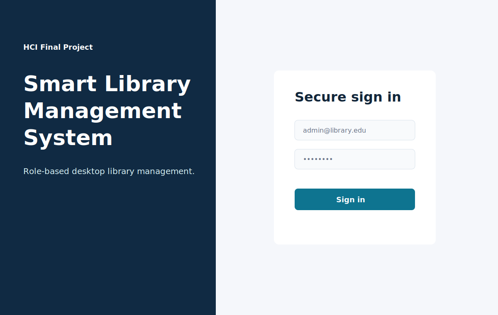
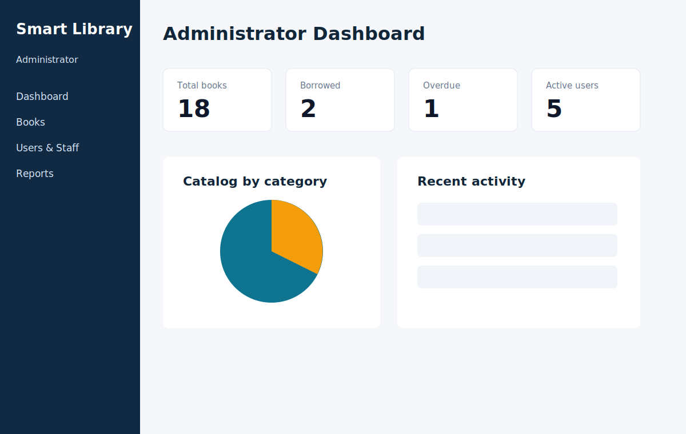
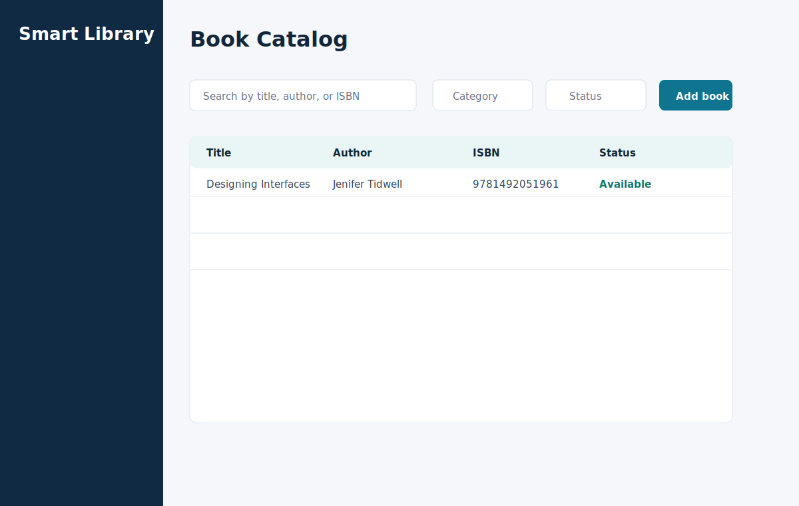
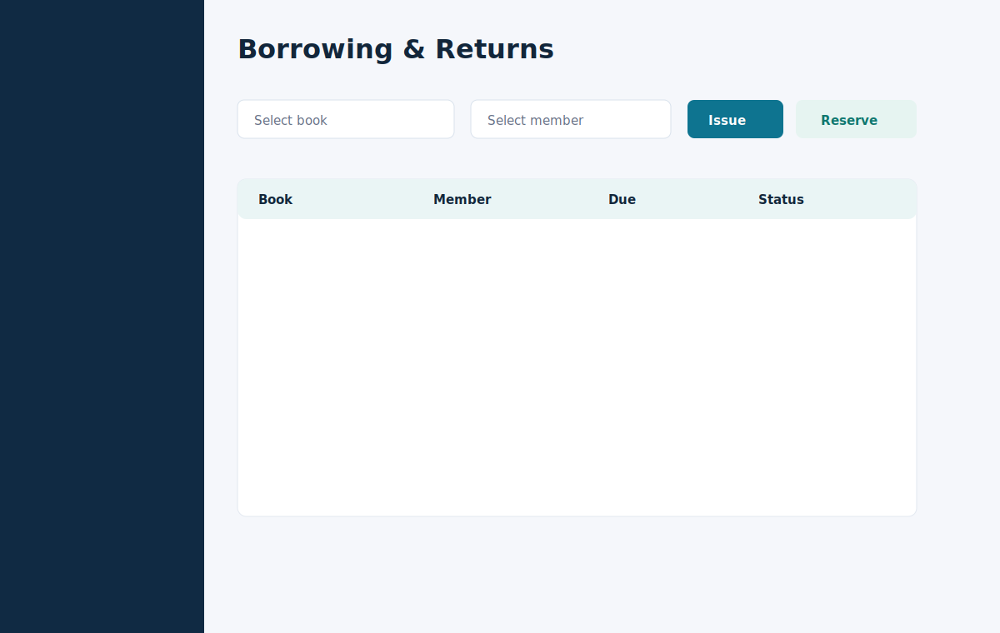

# Smart Library Management System

## Cover Page

**Project Title:** Smart Library Management System  
**Module Name:** [Module Name]  
**Professor Name:** [Professor Name]  
**Academic Year:** [Academic Year]  
**Group Number:** [Group Number]  
**Team Members:** [Student 1], [Student 2], [Student 3]  
**Technologies:** Java 17, JavaFX, Maven, JDBC, MySQL  

---

## Table of Contents

1. Introduction  
2. Requirements Analysis  
3. System Design  
4. UML Modeling  
5. Database Design  
6. UI/UX Design  
7. Implementation  
8. Error Handling and Validation  
9. Testing  
10. Quality Audit  
11. Conclusion  

---

## 1. Introduction

The Smart Library Management System is a desktop application developed for academic library operations. It manages authentication, book catalog records, borrowing, returns, reservations, penalties, notifications, dashboards, users, and activity logs.

The project was developed using Java 17, JavaFX, Maven, JDBC, and MySQL. It follows an MVC-oriented layered architecture and provides a professional interface suitable for a Human Computer Interaction final project.

## 2. Requirements Analysis

The system supports three roles: Administrator, Librarian, and Member. Each role has different responsibilities and different menu access.

Main functional requirements include:

- User login and role-based access.
- Book management.
- Borrowing and return management.
- Reservation queue.
- Fine generation for late returns.
- Search and filtering.
- Dashboard statistics.
- Notifications.
- Activity logs.
- MySQL persistence.

Non-functional requirements include usability, maintainability, reliability, basic security, performance for academic datasets, and compatibility with JavaFX and Maven.

## 3. System Design

The project is organized into the following packages:

| Package | Responsibility |
|---|---|
| `controller` | JavaFX screen logic and user interaction |
| `model` | Domain entities such as User, Book, Borrowing, Fine |
| `dao` | JDBC access to MySQL tables |
| `service` | Business rules, validation, and workflow coordination |
| `util` | Password hashing, session management, and UI helpers |
| `view` | Reusable visual components |

This organization separates interface logic from business rules and database access.

## 4. UML Modeling

The project includes PlantUML diagrams in the `/uml` folder:

- Use Case Diagram.
- Class Diagram.
- Login Sequence Diagram.
- Borrow Book Sequence Diagram.
- Return Book Sequence Diagram.
- Add Book Sequence Diagram.
- User Management Sequence Diagram.

These diagrams describe actors, responsibilities, class relationships, and important runtime workflows.

## 5. Database Design

The MySQL database is named `smart_library`. Main tables include:

- `roles`
- `users`
- `categories`
- `books`
- `borrowings`
- `reservations`
- `fines`
- `notifications`
- `activity_logs`
- `library_settings`

Primary keys use auto-increment integer identifiers. Foreign keys enforce relationships between users, books, borrowings, reservations, fines, notifications, and logs. Constraints enforce unique email, unique ISBN, positive quantity, and valid availability counts.

The SQL script is located at `src/main/resources/sql/schema.sql`.

## 6. UI/UX Design

The interface uses a modern sidebar layout with role-based navigation. Each role sees only the features relevant to its tasks. The dashboard presents important statistics using cards and charts. Tables organize large datasets and dialogs are used for focused data entry.

### Login Screen



The login screen contains a strong project identity area and a focused authentication form. It includes a password visibility option, validation messages, and a loading transition.

### Admin Dashboard



The dashboard summarizes total books, borrowed books, overdue items, active users, reservations, notifications, and recent activities.

### Book Catalog



The catalog supports search, filtering, add/edit operations, CSV export, QR-style preview, and a context menu for table actions.

### Borrowing and Returns



The borrowing screen supports issuing books, reserving unavailable books, returning selected borrowings, and generating fines for late returns.

## 7. Implementation

Authentication is handled by `LoginController`, `UserService`, `PasswordUtil`, and `SessionManager`. Main workflows are handled by `MainController` and delegated to service classes.

JDBC persistence is implemented using DAO classes. Examples:

- `UserDao` inserts and updates user accounts.
- `BookDao` manages catalog records.
- `BorrowingDao` persists borrow and return records.
- `ReservationDao` persists reservation queues.
- `FineDao` persists penalties.
- `NotificationDao` persists notifications.
- `ActivityLogDao` persists audit events.

## 8. Error Handling and Validation

The service layer validates inputs before database operations. Examples include:

- Empty fields are rejected.
- Invalid email format is rejected.
- Duplicate ISBN and duplicate email are rejected.
- Borrowing unavailable books is blocked.
- Duplicate active borrowing is blocked.
- Missing selections in borrowing/return operations are rejected.

The UI displays errors through alert dialogs and success messages through toast notifications.

## 9. Testing

The project was compiled successfully using Maven:

```bash
mvn -q -DskipTests compile
```

Manual testing scenarios include login, adding users, adding books, borrowing books, returning books, generating fines, sending notifications, filtering books, exporting CSV, and checking database persistence.

## 10. Quality Audit

The project satisfies the professor requirements:

- JavaFX desktop interface is implemented.
- MySQL database is provided.
- UML diagrams are generated.
- At least two roles are implemented; the project contains three.
- Error handling and validation exist.
- Notifications and success/error alerts exist.
- UI includes layouts, task decomposition, tabs, context menus, tooltips, charts, and transitions.

## 11. Conclusion

The Smart Library Management System is a coherent academic desktop application that demonstrates software engineering, database design, role-based workflows, and HCI principles. It is suitable for university submission and presentation. Future improvements may include BCrypt password hashing, automated unit tests, richer PDF reporting, and real email delivery.

